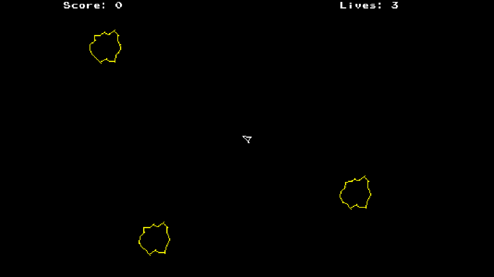

# Asteroids Game, Made with `vbPixelGameEngine`



## Description

A faithful re-creation of the classic Asteroids arcade game using [vbPixelGameEngine](https://github.com/DualBrain/vbPixelGameEngine), which features:

- **Classic Gameplay**: Navigate your spaceship through an asteroid field
- **Procedural Asteroids**: Randomly generated asteroids that break into smaller pieces when destroyed
- **Sound Effects**: Immersive audio including shooting, asteroid destruction, and background music
- **Lives System**: Three lives to complete each level
- **Score Tracking**: Earn points for destroying asteroids and completing levels

> **Note**: The game currently works with basic gameplay, and the gameplay mechanics need further improvement.

## Controls

| Key | Action |
|-----|--------|
| **LEFT/RIGHT** | Rotate ship |
| **UP** | Thrust forward |
| **SPACE** | Fire bullet / Start game |
| **P** | Pause game |
| **ESC** | Quit game |

## Game Features

- **Four Game States**: Title Screen, Playing, Paused, and Game Over
- **Screen Wrapping**: Objects that go off one edge reappear on the opposite side
- **Asteroid Breakdown**: Large asteroids split into smaller ones when destroyed
- **Level Progression**: After clearing all asteroids, new ones spawn around the player

## Technical Details

- **Engine**: vbPixelGameEngine (PixelGameEngine port for Visual Basic)
- **Language**: Visual Basic .NET 10.0
- **Audio**: NAudio library for sound playback
- **Resolution**: 400x300 pixels (fullscreen mode)

## Getting Started

### Prerequisites

- .NET 10.0 SDK or later
- Visual Studio 2026, Visual Studio Code, or other .NET-compatible IDE
- Required NuGet packages:
    - **System.Drawing.Common**: 10.0.0 or later
    - **NAudio**: 2.3.0 or later
    - [VB.NET Record Generator](https://github.com/VBAndCs/VB-Record-Source-Generator)

### Running the Game

1. Clone or download the repository, and navigate to the project directory:
```bash
git clone https://github.com/Pac-Dessert1436/VBPGE-Asteroids-Game.git
cd VBPGE-Asteroids-Game
```
2. Open `VBPGE Asteroids Game.slnx` in Visual Studio 2026
3. Restore the project dependencies:
    - Right-click on the project in the Solution Explorer window
    - Select **Restore NuGet Packages**
4. Build and run the project from the IDE:
    - Click the **Build** menu and select **Build Solution** (or press Ctrl+B)
    - Run the application via "Start" button (or press F5)
5. Press **SPACE** on the title screen to begin playing

### Building from Source

```bash
dotnet build "VBPGE Asteroids Game.vbproj" -c Debug
```

### Running the Executable

Navigate to `bin/Debug/net10.0/` and run `VBPGE Asteroids Game.exe`

## Assets

The game includes the following sound assets:
- `main_theme.mp3` - Background music
- `player_shooting.wav` - Shooting sound effect
- `asteroid_shot.wav` - Asteroid destruction sound
- `life_lost.wav` - Life lost sound

## License

This project is licensed under the MIT License. See the [LICENSE](LICENSE) file for details.